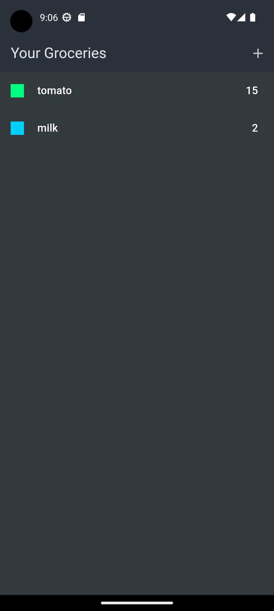

# meals_app

A full functional Flutter Shopping List Application.

## Description

This project is a Flutter Shopping List mobile application which gives the user the ability to :

1. Viewing the available items that are loaded from the database on the screen(loading indicatir will be shown
   while the data is being fetched).
2. Navigating to the adding screen using the + button at the top right corner.
3. Filling the fields in the adding acreen with the wanted info (Item Name, Quantity, Category).
4. Pushing the entered data to the database when pressing the Add Item button(loading indicator
   will be shown inside the button body while pushing the data and the two buttons will be disabled).
5. Deleting the unwanted Grocery Item from the list by swiping it right or left and it will be deleted
   from the database also.

## Back-end

Firebase Realtime database.

## State Management

No state management solution used.

## Features of the app With Screenshots

| Task                           | Screenshot                                                  | Task                                                     | Screenshot                                                                            |
| ------------------------------ | ----------------------------------------------------------- | -------------------------------------------------------- | ------------------------------------------------------------------------------------- |
| Grocery Items screen           |            | New Item Screen                                          |                                           |
| Deleting Items                 |                  | Diabled buttons and loading indicator while sending data |  |
| Loading the data from database |  |                                                          |                                                                                  |
